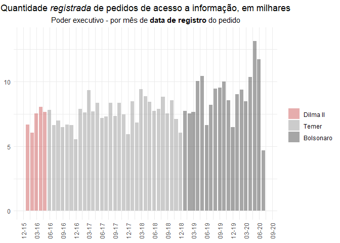
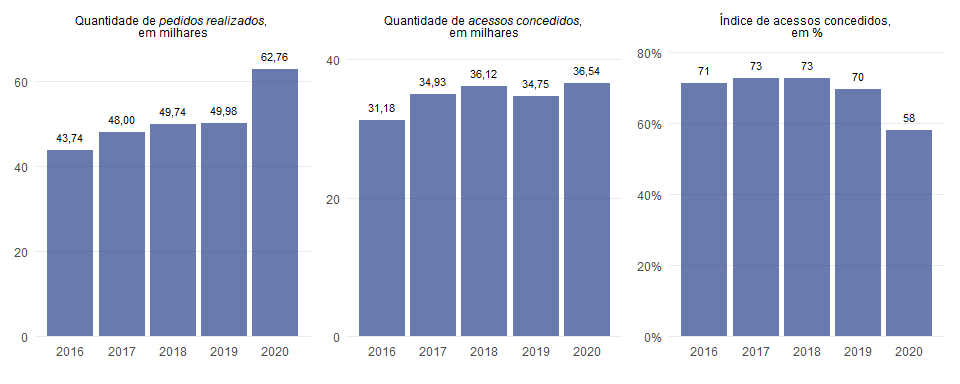
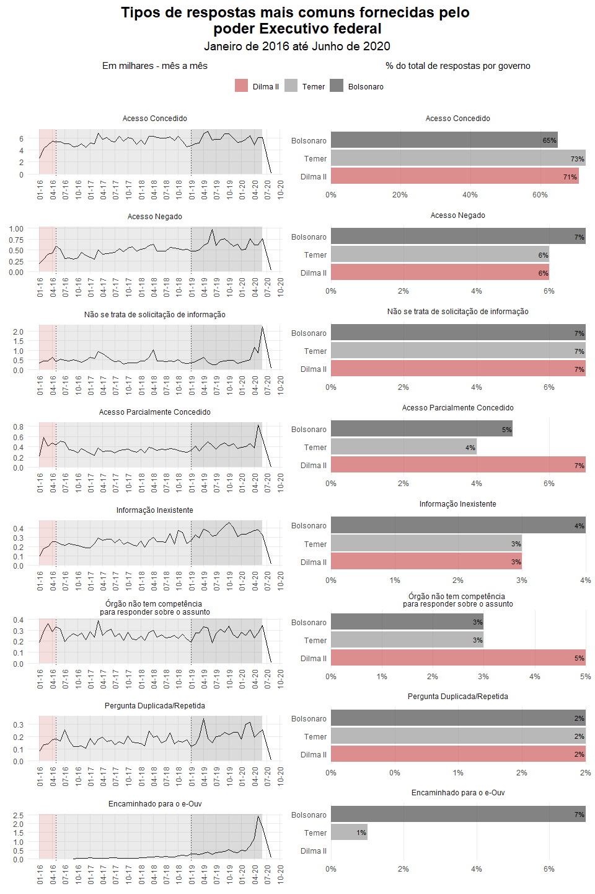
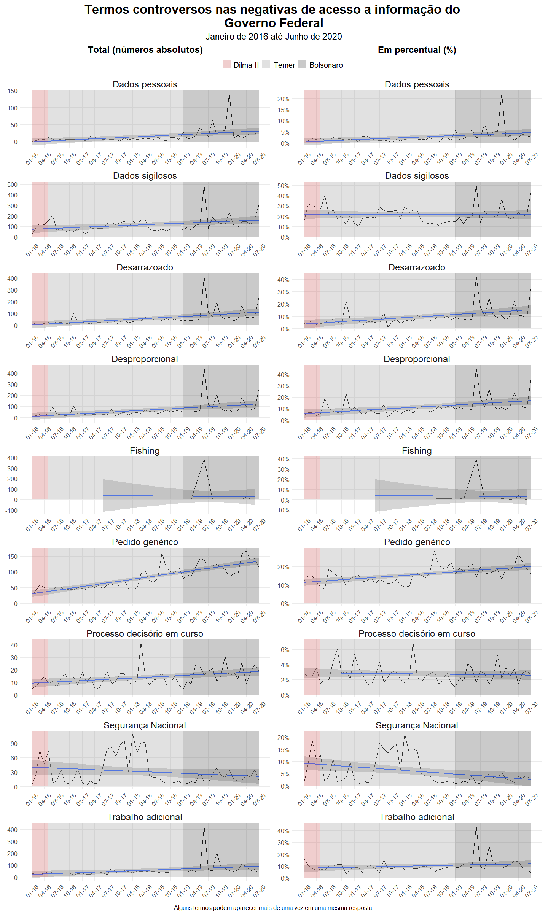
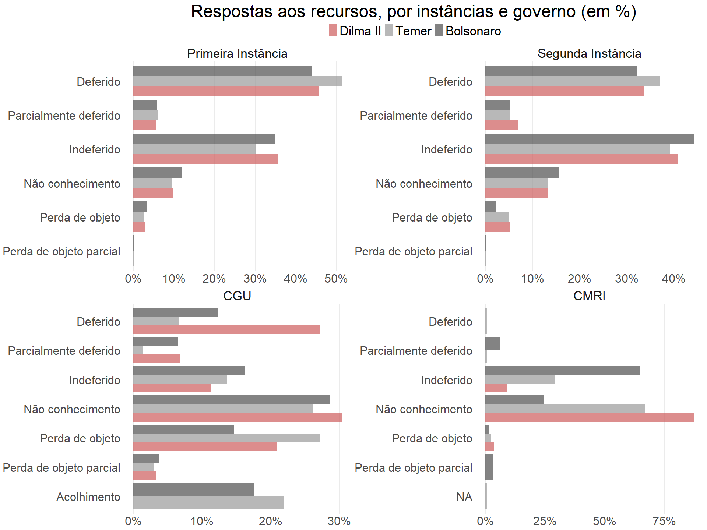

Análise das negativas de acesso a informação no Governo Federal
================

  - [Destaques](#destaques)
  - [Bibliotecas:](#bibliotecas)
      - [Base Pedidos](#base-pedidos)
      - [Recursos](#recursos)
  - [Análises para o relatório](#análises-para-o-relatório)
      - [Índice de acessos concedidos](#índice-de-acessos-concedidos)
      - [Repostas mais comuns na comparação entre os
        governos](#repostas-mais-comuns-na-comparação-entre-os-governos)
      - [Alegações controversas](#alegações-controversas)
      - [Recursos](#recursos-1)
  - [Resultados em planilha excel
    (`xlsxl`)](#resultados-em-planilha-excel-xlsxl)

## Destaques

**Periodicidade:** De 01/01/2016 até 30/06/2020. Este período cobre o
final do segundo mandato de Dilma Rousseff, o mandato de Michel Temer e
o mandato de Jair Bolsonaro até junho de 2020.

Os resultados da análise são destacados a seguir:

  - **Em 2020 verificou-se uma redução dos acessos concedidos** em
    relação ao total de pedidos realizados. A taxa de acessos
    concedidos em 2020 foi de 58% ante uma média de 71,8% verificada nos
    anos anteriores (2016, 2019, 2018 e 2019).

  - **O governo Bolsonaro apresenta a pior proporção de acessos
    concedidos sobre o total de respostas** aos pedidos: 65%, contra 73%
    de acessos concedidos durante o governo Temer e 71% no final do
    governo Dilma.

  - **A proporção de acessos negados sobre o total de respostas aos
    pedidos aumentou no governo Bolsonaro:** foram 7%, comparados aos 6%
    registrados nos governos Dilma e Temer. Sete dos nove termos
    controversos analisados em negativas de acesso tiveram seus picos de
    crescimento durante o governo Bolsonaro: Trabalho adicional,
    Fishing, Desproporcional, Desarrazoado, Pedido genérico, Dados
    sigilosos, Dados pessoais.

  - **O encaminhamento de pedidos feitos via e-SIC à Ouvidoria (e-Ouv)
    se tornou recorrente** e cresceu rapidamente nos últimos meses,
    chegando a 7% do total de respostas. Um dos motivos pode ser a
    pandemia e a criação do auxílio emergencial - cidadãos usaram o
    e-SIC com frequência para tentar tirar dúvidas sobre o benefício.

  - Os dados foram baixados do portal do
    [e-SIC](http://www.consultaesic.cgu.gov.br/busca/_layouts/15/DownloadPedidos/DownloadDados.aspx)
    do Governo Federal. Optou-se pela manipulação dos arquivos em `xml`.

  - O código para extração e tratamento dos arquivos `xml` estão
    disponibilizados [neste script do Jupyter
    Notebook.](/code/download_dados_cgu.ipynb)

  - Na página de downloads do e-SIC também é possível consultar um
    [Dicionário de
    dados.](http://www.consultaesic.cgu.gov.br/arquivosRelatorios/PedidosRespostas/Dicionario-Dados-Exportacao.txt)

-----

## Bibliotecas:

``` r
library(tidyverse)
library(lubridate)
library(ggtext)
library(patchwork)
library(xlsx)
```

-----

### Base Pedidos

Carrega e faz o tratamento da base de pedidos do CGU:

``` r
pedidos_cgu <- read_csv("../data/pedidos_cgu.csv") 


pedidos_cgu <- pedidos_cgu %>%
  mutate(
    DataRegistro = dmy_hms(DataRegistro) %>% as_date() %>% floor_date(unit = "month"),
    DataResposta = dmy_hms(DataResposta) %>% as_date() %>% floor_date(unit = "month"),
    governo_que_respondeu = case_when(
      DataResposta < as_date("2016-05-12") ~ "Dilma II",
      DataResposta < as_date("2019-01-01") ~ "Temer",
      TRUE ~ "Bolsonaro"
    ),
    governo_que_registrou = case_when(
      DataRegistro < as_date("2016-05-12") ~ "Dilma II",
      DataRegistro < as_date("2019-01-01") ~ "Temer",
      TRUE ~ "Bolsonaro"
    ),
    governo_que_respondeu = factor(governo_que_respondeu,
                                   levels = c("Dilma II", "Temer", "Bolsonaro")),
    governo_que_registrou = factor(governo_que_registrou,
                                   levels = c("Dilma II", "Temer", "Bolsonaro"))
  ) %>%
  filter(DataRegistro != floor_date(Sys.Date(), unit = "month"))
```

Inspeciona:

``` r
glimpse(pedidos_cgu)
#> Rows: 439,973
#> Columns: 24
#> $ IdPedido                             <dbl> 345365, 345366, 345367, 345368...
#> $ ProtocoloPedido                      <chr> "99901000001201633", "99902000...
#> $ OrgaoDestinatario                    <chr> "BB – Banco do Brasil S.A.", "...
#> $ OrgaoSuperiorAssociadoaoDestinatario <chr> NA, NA, NA, NA, NA, NA, "ME - ...
#> $ Situacao                             <chr> "Respondido", "Respondido", "R...
#> $ DataRegistro                         <date> 2016-01-01, 2016-01-01, 2016-...
#> $ ResumoSolicitacao                    <chr> "consultar meu cpf . no spc e ...
#> $ DetalhamentoSolicitacao              <chr> "Consulta do cpf no serasa e s...
#> $ PrazoAtendimento                     <chr> "25/01/2016 23:59:59", "25/01/...
#> $ FoiProrrogado                        <chr> "NÃO", "NÃO", "NÃO", "NÃO", "N...
#> $ FoiReencaminhado                     <chr> "NÃO", "NÃO", "NÃO", "NÃO", "S...
#> $ FormaResposta                        <chr> "Pelo sistema (com avisos por ...
#> $ OrigemSolicitacao                    <chr> "Internet", "Internet", "Inter...
#> $ IdSolicitante                        <dbl> 604629, 537117, 604635, 604636...
#> $ CategoriaPedido                      <chr> "Economia e Finanças", "Econom...
#> $ SubCategoriaPedido                   <chr> "Economia", "Economia", "Econo...
#> $ NumeroPerguntas                      <dbl> 1, 1, 1, 2, 1, 1, 1, 1, 1, 1, ...
#> $ DataResposta                         <date> 2016-01-01, 2016-01-01, 2016-...
#> $ Resposta                             <chr> "Prezado(a) Sr(a). Gisela,  En...
#> $ TipoResposta                         <chr> "Acesso Concedido", "Acesso Ne...
#> $ ClassificacaoTipoResposta            <chr> "Resposta solicitada inserida ...
#> $ id_ano                               <chr> "345365_2016", "345366_2016", ...
#> $ governo_que_respondeu                <fct> Dilma II, Dilma II, Dilma II, ...
#> $ governo_que_registrou                <fct> Dilma II, Dilma II, Dilma II, ...
```

-----

### Recursos

Carrega e faz o tratamento da base de recursos do CGU:

``` r
recursos_cgu <- read_csv("../data/recursos_cgu.csv") 
  
recursos_cgu <- recursos_cgu %>%
  mutate(
    DataRegistro = dmy_hms(DataRegistro) %>% as_date() %>% floor_date(unit = "month"),
    DataResposta = dmy_hms(DataResposta) %>% as_date() %>% floor_date(unit = "month"),
    governo_que_respondeu = case_when(
      DataResposta < as_date("2016-05-12") ~ "Dilma II",
      DataResposta < as_date("2019-01-01") ~ "Temer",
      TRUE ~ "Bolsonaro"
    ),
    governo_que_registrou = case_when(
      DataRegistro < as_date("2016-05-12") ~ "Dilma II",
      DataRegistro < as_date("2019-01-01") ~ "Temer",
      TRUE ~ "Bolsonaro"
    ),
    governo_que_respondeu = factor(governo_que_respondeu,
                                   levels = c("Dilma II", "Temer", "Bolsonaro")),
    governo_que_registrou = factor(governo_que_registrou,
                                   levels = c("Dilma II", "Temer", "Bolsonaro")),
    Instancia = factor(Instancia, levels = c("Primeira Instância",
                                             "Segunda Instância", 
                                             "CGU", "CMRI", "Pedido de Revisão")),
    TipoResposta = case_when(is.na(TipoResposta) ~ "NA", TRUE ~ TipoResposta),
    TipoResposta = factor(TipoResposta, levels = c("Deferido", "Parcialmente deferido",
                                                   "Indeferido", "Não conhecimento", 
                                                   "Perda de objeto", "Perda de objeto parcial",
                                                   "Acolhimento", "NA"))
  ) %>%
  filter(DataRegistro != floor_date(Sys.Date(), unit = "month"))
```

Inspeciona:

``` r
glimpse(recursos_cgu)
#> Rows: 46,288
#> Columns: 20
#> $ IdRecurso                            <dbl> 40311, 40312, 40330, 40452, 40...
#> $ DescRecurso                          <chr> "Prezados, Recorro da resposta...
#> $ RespostaRecurso                      <chr> "Prezado Senhor,     Em respos...
#> $ IdPedido                             <dbl> 345473, 345471, 345485, 345612...
#> $ IdSolicitante                        <dbl> 475422, 475422, 604868, 605069...
#> $ ProtocoloPedido                      <chr> "00700000002201687", "16853000...
#> $ OrgaoDestinatario                    <chr> "AGU – Advocacia-Geral da Uniã...
#> $ Instancia                            <fct> Primeira Instância, Primeira I...
#> $ Situacao                             <chr> "Respondido", "Respondido", "R...
#> $ DataRegistro                         <date> 2016-01-01, 2016-01-01, 2016-...
#> $ PrazoAtendimento                     <chr> "11/01/2016 23:59:59", "11/01/...
#> $ OrigemSolicitacao                    <chr> "Internet", "Internet", "Inter...
#> $ TipoRecurso                          <chr> "Informação incompleta", "Info...
#> $ DataResposta                         <date> 2016-01-01, 2016-01-01, 2016-...
#> $ TipoResposta                         <fct> Indeferido, Não conhecimento, ...
#> $ IdRecursoPrecedente                  <dbl> NA, NA, NA, NA, NA, NA, NA, NA...
#> $ OrgaoSuperiorAssociadoaoDestinatario <lgl> NA, NA, NA, NA, NA, NA, NA, NA...
#> $ id_ano                               <chr> "345473_2016", "345471_2016", ...
#> $ governo_que_respondeu                <fct> Dilma II, Dilma II, Dilma II, ...
#> $ governo_que_registrou                <fct> Dilma II, Dilma II, Dilma II, ...
```

-----

## Análises para o relatório

### Índice de acessos concedidos

#### Gráfico 1: Quantidade *registrada* de pedidos de acesso a informação, em milhares (mês a mês).

Prepara a base de pedidos para gerar o gráfico:

``` r
pedidos_por_mes <- pedidos_cgu %>% 
  group_by(DataRegistro, governo_que_registrou) %>%
  summarise(qt = n()) %>%
  ungroup()

glimpse(pedidos_por_mes)
#> Rows: 55
#> Columns: 3
#> $ DataRegistro          <date> 2016-01-01, 2016-02-01, 2016-03-01, 2016-04-...
#> $ governo_que_registrou <fct> Dilma II, Dilma II, Dilma II, Dilma II, Dilma...
#> $ qt                    <int> 6661, 6065, 7531, 8027, 7634, 7825, 6638, 698...
```

Gera o gráfico:

``` r
p <- pedidos_por_mes %>%
  ggplot() +
  geom_bar(
    aes(x=DataRegistro, y = qt, fill = governo_que_registrou),
    stat = "identity", alpha = .5
  ) +
  theme_minimal() +
  scale_fill_manual(
    values = c("indianred", "gray60", "gray30"),
    breaks = pedidos_por_mes %>% distinct(governo_que_registrou) %>% pull()
  ) +
  scale_y_continuous(breaks = seq(0,12500,5000), limits = c(0,13500), labels = seq(0,12.5,5)) +
  scale_x_date(breaks = scales::date_breaks("3 months"), date_labels = "%m-%y") +
  labs(
    x = NULL,
    y = NULL,
    fill = NULL,
    title = "Quantidade *registrada* de pedidos de acesso a informação, em milhares",
    subtitle = "Poder executivo - por mês de **data de registro** do pedido"
  ) +
  theme(
    axis.text.x = element_text(hjust = .5, vjust = .5, angle = 90),
    plot.title = element_markdown(vjust = .5, hjust = .5),
    plot.subtitle = element_markdown(vjust = .5, hjust = .5)
  )
```

Visualiza:

``` r
p
```



Guarda evidencia:

``` r
# Grafico 1
write.xlsx(as.data.frame(pedidos_por_mes), "../data/pedidos_por_mes.xlsx")
```

#### gráfico 2: Índice de acessos concedidos (ano a ano)

  - 2a: Quantidade de pedidos realizados, em milhares;
  - 2b: Quantidade de acessos concedidos, em milhares;
  - 2c: Índice de acessos concedidos, em %.

Prepara a base de pedidos para gerar o gráfico:

``` r
# Quantidades de pedidos, em milhares
pedidos_mesmo_periodo <- pedidos_cgu %>%
  select(DataRegistro, IdPedido) %>%
  filter(month(DataRegistro) < 7) %>%
  mutate(DataRegistro = floor_date(DataRegistro, unit = "year")) %>%
  group_by(DataRegistro) %>%
  summarise(qt = n()) %>%
  ungroup()

glimpse(pedidos_mesmo_periodo)
#> Rows: 5
#> Columns: 2
#> $ DataRegistro <date> 2016-01-01, 2017-01-01, 2018-01-01, 2019-01-01, 2020-...
#> $ qt           <int> 43743, 47997, 49743, 49975, 62073

# Acessos concedidos 
acessos_concedidos_mesmo_periodo <- pedidos_cgu %>%
  filter(TipoResposta == "Acesso Concedido") %>%
  select(DataRegistro, IdPedido) %>%
  filter(month(DataRegistro) < 7) %>%
  mutate(DataRegistro = floor_date(DataRegistro, unit = "year")) %>%
  group_by(DataRegistro) %>%
  summarise(qt = n())

glimpse(acessos_concedidos_mesmo_periodo)
#> Rows: 5
#> Columns: 2
#> $ DataRegistro <date> 2016-01-01, 2017-01-01, 2018-01-01, 2019-01-01, 2020-...
#> $ qt           <int> 31180, 34933, 36124, 34747, 36119

# Índices de acessos concedidos
indice_respostas_concedidas <- pedidos_mesmo_periodo %>%
  left_join(acessos_concedidos_mesmo_periodo, by = "DataRegistro", suffix = c("_pedidos", "_concedidos")) %>%
  mutate(indice_acessos_concedidos = qt_concedidos / qt_pedidos)

glimpse(indice_respostas_concedidas)
#> Rows: 5
#> Columns: 4
#> $ DataRegistro              <date> 2016-01-01, 2017-01-01, 2018-01-01, 2019...
#> $ qt_pedidos                <int> 43743, 47997, 49743, 49975, 62073
#> $ qt_concedidos             <int> 31180, 34933, 36124, 34747, 36119
#> $ indice_acessos_concedidos <dbl> 0.7127998, 0.7278163, 0.7262127, 0.695287...
```

Gera os gráficos:

``` r
# A quantidade de pedidos aumentou...
p1 <- pedidos_mesmo_periodo %>%
  mutate(qt = round(qt/1000, 2)) %>%
  ggplot() +
  geom_bar(aes(x = DataRegistro, y = qt), stat = "identity", fill = "royalblue4", alpha = .7) +
  labs(
    x = NULL,
    y = NULL,
    title = "Quantidade de *pedidos realizados*, <br>em milhares"
  ) +
  geom_text(aes(x = DataRegistro, y = qt, label = format(qt, nsmall = 2L, decimal.mark = ",")),
                vjust = -1, size = 3) +
  theme_minimal() +
  theme(
    plot.title = element_markdown(vjust = .5, hjust = .5, size = 9),
    plot.subtitle = element_markdown(vjust = .5, hjust = .5),
    panel.grid.minor = element_blank(),
    panel.grid.major.x = element_blank(),
    axis.text.x = element_text(vjust = 7)
  )  +
  scale_y_continuous(breaks = seq(0, 65, 20), limits = c(0,65))

#...mas a quantidade de acessos continuou estável...
p2 <- acessos_concedidos_mesmo_periodo %>%
  mutate(qt = round(qt/1000, 2)) %>%
  ggplot() +
  geom_bar(aes(x = DataRegistro, y = qt), stat = "identity", fill = "royalblue4", alpha = .7) +
  labs(
    x = NULL,
    y = NULL,
    title = "Quantidade de *acessos concedidos*, <br>em milhares"
  ) +
  geom_text(aes(x = DataRegistro, y = qt, label = format(qt, nsmall = 2L, decimal.mark = ",")),
            vjust = -1, size = 3) +
  theme_minimal() +
  theme(
    plot.title = element_markdown(vjust = .5, hjust = .5, size = 9),
    plot.subtitle = element_markdown(vjust = .5, hjust = .5),
    panel.grid.minor = element_blank(),
    panel.grid.major.x = element_blank(),
    axis.text.x = element_text(vjust = 7)
  ) +
  scale_y_continuous(breaks = seq(0, 40, 20), limits = c(0,40))

#...como consequência, a taxa de acessos concedidos caiu.
p3 <- indice_respostas_concedidas %>%
  ggplot() +
  geom_bar(aes(x = DataRegistro, y = indice_acessos_concedidos), fill = "royalblue4",
           stat = "identity", alpha = .7) +
  geom_text(aes(x = DataRegistro, y = indice_acessos_concedidos, 
                label = round(indice_acessos_concedidos*100)), vjust = -1, size = 3) +
  scale_y_continuous(labels = scales::percent_format(), limits = c(0,.78)) +
  labs(
    x = NULL,
    y = NULL,
    title = "Índice de acessos concedidos, <br>em %"
  ) +
  theme_minimal() +
  theme(
    plot.title = element_markdown(vjust = .5, hjust = .5, size = 9),
    plot.subtitle = element_markdown(vjust = .5, hjust = .5),
    panel.grid.minor = element_blank(),
    panel.grid.major.x = element_blank(),
    axis.text.x = element_text(vjust = 7)
  )
```

Visualiza:

``` r
p1 + p2 + p3
```



Salva evidencias

``` r
# Grafico 2
write.xlsx(as.data.frame(indice_respostas_concedidas), "../data/indice_respostas_concedidas.xlsx")
```

-----

### Repostas mais comuns na comparação entre os governos

#### Gráfico 3: Tipos de respostas mais comuns fornecidas pelo Executivo federal

Prepara a base que gera o gráfico:

``` r
# tipo respostas mais comuns histórico -----------------------------------------
respostas_comuns <- pedidos_cgu %>%
  filter(DataResposta != floor_date(Sys.Date(), unit = "month")) %>%
  group_by(DataResposta, TipoResposta, governo_que_respondeu) %>%
  summarise(qt = n()) %>%
  ungroup() %>%
  group_by(governo_que_respondeu) %>%
  ungroup() %>%
  mutate(
    TipoResposta = case_when(
      TipoResposta == "Órgão não tem competência para responder sobre o assunto" ~
        "Órgão não tem competência \npara responder sobre o assunto",
      TRUE ~ TipoResposta
      )
    ) %>%
  mutate(TipoResposta = fct_reorder(TipoResposta, qt/100, .desc = T))

glimpse(respostas_comuns)
#> Rows: 432
#> Columns: 4
#> $ DataResposta          <date> 2016-01-01, 2016-01-01, 2016-01-01, 2016-01-...
#> $ TipoResposta          <fct> Acesso Concedido, Acesso Negado, Acesso Parci...
#> $ governo_que_respondeu <fct> Dilma II, Dilma II, Dilma II, Dilma II, Dilma...
#> $ qt                    <int> 2562, 181, 211, 92, 345, 186, 80, 4240, 284, ...

# respostas total por governo --------------------------------------------------
aux <- respostas_comuns %>% 
  filter(DataResposta != floor_date(Sys.Date(), unit = "month")) %>%
  group_by(governo_que_respondeu) %>%
  summarise(qt = sum(qt)) %>% 
  ungroup()

glimpse(aux)
#> Rows: 3
#> Columns: 2
#> $ governo_que_respondeu <fct> Dilma II, Temer, Bolsonaro
#> $ qt                    <int> 32011, 235966, 171996

# finaliza rcom taxa de tipo/total de respostas --------------------------------
respostas_comuns_gov <- respostas_comuns %>% 
  filter(DataResposta != floor_date(Sys.Date(), unit = "month")) %>%
  group_by(governo_que_respondeu, TipoResposta) %>%
  summarise(qt = sum(qt)) %>% 
  ungroup() %>%
  left_join(aux, by="governo_que_respondeu", suffix = c("_tipo_resposta", "_respostas_total")) %>%
  mutate(perc = round(qt_tipo_resposta / qt_respostas_total, 2))

glimpse(respostas_comuns_gov)
#> Rows: 23
#> Columns: 5
#> $ governo_que_respondeu <fct> Dilma II, Dilma II, Dilma II, Dilma II, Dilma...
#> $ TipoResposta          <fct> Acesso Concedido, Acesso Negado, Não se trata...
#> $ qt_tipo_resposta      <int> 22585, 1878, 2282, 2127, 981, 1456, 702, 1728...
#> $ qt_respostas_total    <int> 32011, 32011, 32011, 32011, 32011, 32011, 320...
#> $ perc                  <dbl> 0.71, 0.06, 0.07, 0.07, 0.03, 0.05, 0.02, 0.7...
```

Gera o gráfico:

``` r
# cores de fundo ---------------------------------------------------------------
rect_gov<- respostas_comuns %>% 
  filter(DataResposta %in% ymd(c("2016-02-01", "2016-06-01", "2019-02-01"))) %>%
  group_by(governo_que_respondeu) %>%
  summarise(xmin = min(DataResposta) - months(1),
            #xmax = max(DataResposta),
            ymin = 0,
            ymax = Inf) %>%
  ungroup() %>%
  mutate(xmax = lead(xmin, default = floor_date(Sys.Date(), unit = "month") - months(1)))

# plot esquerdo ----------------------------------------------------------------
p1 <- respostas_comuns %>%
  ggplot() +
  geom_line(aes(x = DataResposta, y = qt/1000, show.legend = F)) +
  geom_vline(xintercept = ymd(c("2016-05-01", "2019-01-01")), lty=3) +
  geom_rect(
    data = rect_gov,
    aes(xmin = xmin, xmax = xmax, ymin = ymin, ymax = ymax, fill = governo_que_respondeu), 
    alpha = .2, show.legend = F
  ) +
  scale_fill_manual(
    values = c("indianred", "gray60", "gray30"),
    breaks = pedidos_por_mes %>% distinct(governo_que_registrou) %>% pull()
  ) +
  theme_minimal() +
  theme(
    legend.position = "top",
    legend.text = element_text(size = 8),
    axis.text.x = element_text(hjust = .5, vjust = .5, angle = 90),
    plot.title = element_text(vjust = .5, hjust = .5),
    plot.subtitle = element_text(vjust = .5, hjust = .5),
    panel.grid.minor = element_blank()
  ) +
  scale_color_brewer(palette = "Set1") +
  scale_x_date(breaks = scales::date_breaks("3 months"), date_labels = "%m-%y") +
  labs(
    x = NULL,
    y = NULL,
    subtitle = "Em milhares - mês a mês",
    color = NULL,
    fill = NULL
  ) +
  facet_wrap(~TipoResposta, scales = 'free', ncol = 1)

# plot direito -----------------------------------------------------------------
p2 <- respostas_comuns_gov %>% 
  ggplot(aes(x = governo_que_respondeu, y = perc, fill = governo_que_respondeu)) +
  geom_bar(stat = "identity", alpha = .7) +
  geom_text(aes(label = scales::percent(perc, accuracy = 1)),
            size = 3, hjust = 1.1, check_overlap = T) +
  scale_y_continuous(labels = scales::percent_format(accuracy = 1), expand=c(0,0)) +
  coord_flip() +
  facet_wrap(~TipoResposta, scales = "free_x", ncol = 1) +
  labs(
    x = NULL,
    y = NULL,
    fill = NULL,
    subtitle = "% do total de respostas por governo"
  ) +
  theme_minimal() +
  scale_fill_manual(
    values = c("indianred", "gray60", "gray30"),
    breaks = pedidos_por_mes %>% distinct(governo_que_registrou) %>% pull()
  ) +
  theme(
    panel.grid.major.y = element_blank(),
    panel.grid.minor.x = element_blank(),
    plot.title = element_text(hjust = .5, vjust = .5),
    plot.subtitle = element_text(hjust = .5, vjust = .5)
  )
```

Visualiza:



Salva evidência:

``` r
# Grafico 3
write.xlsx(as.data.frame(respostas_comuns), "../data/respostas_comuns.xlsx")
write.xlsx(as.data.frame(respostas_comuns_gov), "../data/respostas_comuns_gov.xlsx")
```

-----

### Alegações controversas

#### Gráfico: Termos controversos nas negativas de acesso a informação do governo Federal

Prepara base que gera o gráfico:

``` r
# Total e pedidos para mês------------------------------------------------------
aux_mes <- pedidos_cgu %>% 
  filter(DataResposta != floor_date(Sys.Date(), unit = "month")) %>%
  filter(TipoResposta == "Acesso Negado") %>%
  group_by(DataResposta) %>%
  summarise(total_acessos_negados_mes = n()) %>%
  ungroup()

glimpse(aux_mes)
#> Rows: 55
#> Columns: 2
#> $ DataResposta              <date> 2016-01-01, 2016-02-01, 2016-03-01, 2016...
#> $ total_acessos_negados_mes <int> 181, 284, 399, 427, 587, 511, 298, 321, 2...

# Total de acessos negados por governo------------------------------------------
aux_gov <- pedidos_cgu %>%
  filter(DataResposta != floor_date(Sys.Date(), unit = "month")) %>%
  filter(TipoResposta == "Acesso Negado") %>%
  group_by(governo_que_respondeu) %>%
  summarise(total_acessos_negados_gov = n()) %>%
  ungroup()

glimpse(aux_gov)
#> Rows: 3
#> Columns: 2
#> $ governo_que_respondeu     <fct> Dilma II, Temer, Bolsonaro
#> $ total_acessos_negados_gov <int> 1878, 14325, 12199

# termos controversos ----------------------------------------------------------
termos_controversos <- c(
  'desarrazoado',
  'fishing',
  'desproporciona[l|is]',
  'segurança nacional',
  'segurança do estado',
  'sigilo',
  'processo decis[ó|o]rio em curso',
  'documento preparat[ó|o]rio',
  'trabalho[s]? adiciona',
  'dado[s]? pesso',
  'gen[e|é]rico'
  ) %>%
  paste0(collapse = "|")

# tbl com termos controversos --------------------------------------------------
controversos <- pedidos_cgu %>% 
  filter(TipoResposta == "Acesso Negado") %>%
  filter(DataResposta != floor_date(Sys.Date(), unit = "month")) %>%
  select(DataResposta, TipoResposta, Resposta, governo_que_respondeu, IdPedido) %>%
  filter(str_detect(tolower(Resposta), termos_controversos)) %>%
  mutate(
    controversos_desarrazoado = str_detect(Resposta,'desarrazoado'), 
    controversos_fishing  = str_detect(Resposta,'fishing'),
    controversos_desproporcional =  str_detect(Resposta,'desproporciona[l|is]'),
    controversos_seguranca =  str_detect(Resposta,'segurança [nacional|do estado]'),
    controversos_sigilo = str_detect(Resposta,'sigilo'),
    controversos_decisao =  str_detect(Resposta,'processo decis[ó|o]rio em curso|documento preparat[ó|o]rio'),
    controversos_trabalho_adic = str_detect(Resposta,'trabalho[s]? adiciona'),
    controversos_dados_pessoais =  str_detect(Resposta,'dado[s]? pesso'),
    controversos_generico =  str_detect(Resposta,'gen[e|é]rico')
    ) %>% 
  inner_join(aux_mes, by = c("DataResposta")) %>%          # acesso negado/mês
  inner_join(aux_gov, by = c("governo_que_respondeu")) %>% # acesso negado/governo
  pivot_longer(names_to = "controversos", cols = starts_with("controversos"), 
               values_to = "prevalencia", names_prefix = "controversos_")

# Agrupa prevalência de palavras -----------------------------------------------
controversos2 <- controversos %>%
  group_by(DataResposta, 
           governo_que_respondeu,
           total_acessos_negados_gov,
           total_acessos_negados_mes,
           controversos,
           prevalencia) %>%
  summarise(qt_prevalencia = n()) %>%
  ungroup() 

# Remove pedidos sem os termos e trata base ------------------------------------
controversos2 <- controversos2 %>% 
  filter(prevalencia == TRUE) %>%
  mutate(controversos = case_when(
    controversos == "desarrazoado" ~ "Desarrazoado",
    controversos == "fishing" ~ "Fishing",
    controversos == "desproporcional" ~ "Desproporcional",
    controversos == "seguranca" ~ "Segurança Nacional",
    controversos == "sigilo" ~ "Dados sigilosos",
    controversos == "decisao" ~ "Processo decisório em curso",
    controversos == "trabalho_adic" ~"Trabalho adicional",
    controversos == "dados_pessoais" ~ "Dados pessoais",
    controversos == "generico" ~ "Pedido genérico",
    TRUE ~ controversos
  )) %>%
  mutate(controversos = fct_reorder(controversos, prevalencia),
         perc = round(qt_prevalencia / total_acessos_negados_mes, 4))

# inspeciona
glimpse(controversos2)
#> Rows: 455
#> Columns: 8
#> $ DataResposta              <date> 2016-01-01, 2016-01-01, 2016-01-01, 2016...
#> $ governo_que_respondeu     <fct> Dilma II, Dilma II, Dilma II, Dilma II, D...
#> $ total_acessos_negados_gov <int> 1878, 1878, 1878, 1878, 1878, 1878, 1878,...
#> $ total_acessos_negados_mes <int> 181, 181, 181, 181, 181, 181, 181, 181, 2...
#> $ controversos              <fct> Dados pessoais, Processo decisório em cur...
#> $ prevalencia               <lgl> TRUE, TRUE, TRUE, TRUE, TRUE, TRUE, TRUE,...
#> $ qt_prevalencia            <int> 1, 5, 7, 7, 22, 2, 25, 30, 3, 7, 18, 19, ...
#> $ perc                      <dbl> 0.0055, 0.0276, 0.0387, 0.0387, 0.1215, 0...

# Posso somar a prevalência (ou não-prevalência, se prevalencia==FALSE) de um termo, por governante:
controversos_gov <- controversos2 %>%
  group_by(governo_que_respondeu, controversos, prevalencia) %>%
  summarise(qt_prevalencia_por_gov = sum(qt_prevalencia))
```

Gera os gráficos:

``` r
# plot esquerdo ----------------------------------------------------------------
p1 <- controversos2 %>%
  ggplot() +
  geom_line(aes(x = DataResposta, y = qt_prevalencia)) +
  geom_smooth(aes(x = DataResposta, y = qt_prevalencia), method="lm") +
  geom_rect(
    data = rect_gov,
    aes(xmin = xmin, xmax = xmax, ymin = ymin, ymax = ymax, fill = governo_que_respondeu), 
    alpha = .3, show.legend = F
  ) +
  scale_fill_manual(
    values = c("indianred", "gray60", "gray30"),
    breaks = pedidos_por_mes %>% distinct(governo_que_registrou) %>% pull()
  ) +
  scale_x_date(breaks = scales::date_breaks("3 months"), date_labels = "%m-%y") +
  theme_minimal() +
  theme(
    legend.position = "top",
    legend.text = element_text(size = 15),
    axis.text.x = element_text(hjust = .5, vjust = .5, angle = 45, size = 12),
    axis.text.y = element_text(size = 12),
    plot.title = element_text(vjust = .5, hjust = .5),
    plot.subtitle = element_markdown(vjust = .5, hjust = .5, size = 18),
    panel.grid.minor = element_blank(),
    strip.text.x = element_text(size = 18)
  ) +
  labs(
    x = NULL,
    y = NULL,
    subtitle = "**Total \n(números absolutos)**",
    color = NULL,
    fill = NULL
  ) +
  facet_wrap(~controversos, scales = 'free', ncol = 1)

# plot direita -----------------------------------------------------------------
p2 <- controversos2 %>%
  ggplot() +
  geom_line(aes(x = DataResposta, y = perc)) +
  geom_smooth(aes(x = DataResposta, y = perc), method="lm") +
  geom_rect(
    data = rect_gov,
    aes(xmin = xmin, xmax = xmax, ymin = ymin, ymax = ymax, fill = governo_que_respondeu), 
    alpha = .3, show.legend = T
  ) +
  scale_fill_manual(
    values = c("indianred", "gray60", "gray30"),
    breaks = pedidos_por_mes %>% distinct(governo_que_registrou) %>% pull()
  ) +
  scale_x_date(breaks = scales::date_breaks("3 months"), date_labels = "%m-%y") +
  scale_y_continuous(labels = scales::percent_format(accuracy = 1)) +
  theme_minimal() +
  theme(
    legend.position = "top",
    legend.text = element_text(size = 15),
    axis.text.x = element_text(hjust = .5, vjust = .5, angle = 45, size = 12),
    axis.text.y = element_text(size = 12),
    plot.title = element_markdown(vjust = .5, hjust = .5),
    plot.subtitle = element_markdown(vjust = .5, hjust = .5, size = 18),
    panel.grid.minor = element_blank(),
    strip.text.x = element_text(size = 18)
  ) +
  labs(
    x = NULL,
    y = NULL,
    subtitle = "**Em percentual (%)**",
    color = NULL,
    fill = NULL
  )  +
  #scale_y_continuous(scales::percent) +
  facet_wrap(~controversos, scales = 'free', ncol = 1)
```

Visualiza:



Guarda evidência:

``` r
# Grafico 4
write.xlsx(as.data.frame(controversos2), "../data/controversos2.xlsx" )
```

-----

### Recursos

Prepara a base que gera o gráfico:

``` r
#tipo de resposta por recurso e por instância ----------------------------------
recursos_por_instancia_e_resposta <- recursos_cgu %>%
  filter(month(DataRegistro) < 7) %>%
  group_by(governo_que_registrou, TipoResposta, Instancia) %>%
  summarise(qt_tipo_repostas_instancia = n())

glimpse(recursos_por_instancia_e_resposta)
#> Rows: 72
#> Columns: 4
#> Groups: governo_que_registrou, TipoResposta [21]
#> $ governo_que_registrou      <fct> Dilma II, Dilma II, Dilma II, Dilma II, ...
#> $ TipoResposta               <fct> Deferido, Deferido, Deferido, Parcialmen...
#> $ Instancia                  <fct> Primeira Instância, Segunda Instância, C...
#> $ qt_tipo_repostas_instancia <int> 927, 146, 130, 117, 30, 33, 723, 177, 54...

# total respostas por instância ------------------------------------------------
recursos_por_instancia <- recursos_por_instancia_e_resposta %>% 
  group_by(governo_que_registrou, Instancia) %>%
  summarise(qt_respostas_instancia = sum(qt_tipo_repostas_instancia))

glimpse(recursos_por_instancia)
#> Rows: 14
#> Columns: 3
#> Groups: governo_que_registrou [3]
#> $ governo_que_registrou  <fct> Dilma II, Dilma II, Dilma II, Dilma II, Teme...
#> $ Instancia              <fct> Primeira Instância, Segunda Instância, CGU, ...
#> $ qt_respostas_instancia <int> 2029, 434, 478, 55, 7646, 1992, 1449, 334, 6...

recursos_por_instancia_e_resposta <- recursos_por_instancia_e_resposta %>%
  left_join(recursos_por_instancia, by = c("governo_que_registrou", "Instancia")) %>%
  mutate(perc = round(qt_tipo_repostas_instancia / qt_respostas_instancia, 4))

glimpse(recursos_por_instancia_e_resposta)
#> Rows: 72
#> Columns: 6
#> Groups: governo_que_registrou, TipoResposta [21]
#> $ governo_que_registrou      <fct> Dilma II, Dilma II, Dilma II, Dilma II, ...
#> $ TipoResposta               <fct> Deferido, Deferido, Deferido, Parcialmen...
#> $ Instancia                  <fct> Primeira Instância, Segunda Instância, C...
#> $ qt_tipo_repostas_instancia <int> 927, 146, 130, 117, 30, 33, 723, 177, 54...
#> $ qt_respostas_instancia     <int> 2029, 434, 478, 2029, 434, 478, 2029, 43...
#> $ perc                       <dbl> 0.4569, 0.3364, 0.2720, 0.0577, 0.0691, ...
```

``` r
p <-  recursos_por_instancia_e_resposta %>% 
  filter(Instancia != "Pedido de Revisão") %>%
  ggplot() +
  geom_bar(aes(x = fct_rev(TipoResposta), y = perc, fill = governo_que_registrou),
           stat = "identity", position = "dodge", alpha = .7) +
  coord_flip() +
  facet_wrap(~Instancia, scales = "free", nrow = 3, ncol = 2) +
  labs(
    x = NULL,
    y = NULL,
    title = "Respostas aos recursos, por instâncias e governo (em %)",
    subtitle = NULL,
    fill = NULL
  ) +
  theme_minimal() +
  scale_fill_manual(
    values = c("indianred", "gray60", "gray30"),
    breaks = pedidos_por_mes %>% distinct(governo_que_registrou) %>% pull()
  ) +
  scale_y_continuous(labels = scales::percent_format(accuracy = 1)) +
  theme(
    legend.position = "top",
    panel.grid.major.y = element_blank(),
    panel.grid.minor.x = element_blank(),
    axis.text = element_text(size = 24),
    plot.title = element_text(hjust = .5, vjust = .5, size = 35),
    plot.subtitle = element_text(hjust = .5, vjust = .5, size = 20),
    strip.text.x = element_text(size = 26),
    legend.text = element_text(size = 26)
    
  )
```

Visualiza:



Salva evidência:

``` r
# Grafico 5
write.xlsx(as.data.frame(recursos_por_instancia_e_resposta), "../data/recursos_por_instancia_e_resposta.xlsx" )
```

## Resultados em planilha excel (`xlsxl`)

Para gerar os gráficos, separamos os datasets em .xlsx: [leia
aqui](/data/leiame.md) depois [baixe aqui.](/data)

**FIM** :smiley:
